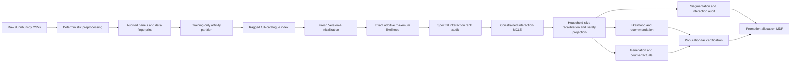

# Codebase architecture and implementation audit

For the model and pipeline as one mathematical narrative, including the staged
interaction argument and the two household-size updates, read
[`PIPELINE_TEXTBOOK.md`](PIPELINE_TEXTBOOK.md) alongside this implementation map.

## 1. Purpose and scope

This document explains how the repository implements the Version-4 energy basket model,
from raw dunnhumby files to a fitted checkpoint and retailer-facing evaluations. It is an
architecture document, not a second theory document. The mathematical source of truth is
`paper/version4.html`, with expanded derivations in `paper/THEORY.md` and numerical details
in `paper/ESTIMATOR.md`.

The initial audit was performed against commit `1db2ae2` on 4 September 2026. Its
high-confidence remediations were implemented on branch
`architecture-hardening-cleanup` without changing the Version-4 probability law. It
covered:

- every tracked Python and C++ source file;
- the three executable drivers;
- data, feature, model, estimator, training, evaluation and simulation paths;
- checkpoint and report lineage;
- recovery and hardware behavior;
- all 66 automated tests after remediation; and
- consistency between the selected pipeline and the result documents.

The repository contains no licensed raw data, derived data or fitted artifacts, so this
audit could verify code paths and unit/integration contracts but could not reproduce the
long full-data fit from this clean checkout.

## 2. The system in one view

There are three independent executable workflows:

1. `scripts/run_pipeline.py` is the selected real-data model pipeline.
2. `scripts/run_baselines.py` trains and evaluates comparison models.
3. `scripts/run_synthetic_experiment.py` runs small exact-enumeration experiments where
   the ground truth is known.

The selected real-data path is:



The same `RaggedModel` parameter state is used by likelihood, recommendation,
counterfactuals and basket generation. There is no separately trained recommender. The
workflow is staged because the additive submodel has an exact normalizer, while the Gram
interaction block requires a different numerical treatment.

## 3. Repository layout

| Path | Responsibility | Runtime role |
|---|---|---|
| `README.md` | Installation, execution, recovery and current empirical summary | User entry point |
| `paper/version4.html` | Foundational probability model and propositions | Mathematical source of truth |
| `paper/THEORY.md` | Full model derivation | Reference |
| `paper/ESTIMATOR.md` | Exact DP, Smolyak and stochastic-estimator analysis | Reference |
| `paper/INFERENCE_AND_SIMULATION.md` | Sampling, counterfactual and MDP derivations | Reference |
| `paper/*.md` | Specialized methods, results and operational guides | Reference |
| `scripts/run_pipeline.py` | Real-data orchestration, preflight and resurrection | Primary executable |
| `scripts/run_baselines.py` | Baseline training and locked comparison | Secondary executable |
| `scripts/run_synthetic_experiment.py` | Exact small-world validation | Secondary executable |
| `scripts/runtime_capabilities.py` | Hardware discovery and certified-backend policy | Shared infrastructure |
| `scripts/file_lock.py` | Cross-platform single-writer process locks | Shared infrastructure |
| `scripts/data/` | Raw-to-derived preprocessing and independent audit | Data layer |
| `scripts/version4/` | Model, numerical kernels, fitting and evaluation programs | Statistical core |
| `scripts/version4/provenance.py` | Strict JSON and model-data/artifact content identities | Statistical infrastructure |
| `scripts/version4/checkpoint_io.py` | Fail-closed loading, relocation and capability checks | Statistical infrastructure |
| `scripts/version4/pipeline_support.py` | Neutral split, quadrature, size-law and inference helpers | Statistical infrastructure |
| `tests/` | Unit and orchestration-contract tests | Verification |
| `data/` | Intermediate Parquet panels | Generated, Git-ignored |
| `basket_input/` | Model-ready panels and indexes | Generated, Git-ignored |
| `artifacts/` | Initialization, interaction bases, candidates and runtime records | Generated, Git-ignored |
| `out/` | Additive and baseline checkpoints, histories and logs | Generated, Git-ignored |
| `reports/` | Evaluation and certification reports | Generated, Git-ignored |

The code is script-oriented rather than installed as a Python package. The drivers prepend
`scripts/version4/` and `artifacts/native/lib/` to `PYTHONPATH`, so modules use imports such
as `from ragged import RaggedModel`. This works for the drivers and tests, but it means the
repository does not currently expose a stable importable application API.

## 4. Runtime and orchestration layer

### 4.1 Hardware policy

`scripts/runtime_capabilities.py` records Python, operating system, CPU count, memory,
free disk, PyTorch, CUDA and MPS information in
`artifacts/runtime_capabilities.json`.

The certified backend is CPU float64. CUDA and MPS are detected but rejected because the
dominant category/cardinality polynomial kernel is a CPU C++ extension and the rank stage
uses SciPy CPU solvers. `--device auto` therefore means “choose the fastest certified
backend,” which is currently CPU; it does not move training to an accelerator.

The driver defaults to a hardware-aware CPU thread count capped at eight. Full mode also
requires approximately 12 GiB of RAM and 5 GiB of free workspace disk.

### 4.2 Driver behavior

`scripts/run_pipeline.py` owns the stage graph, fixed full/smoke profiles, subprocess
environment and fail-closed gates. It always:

- checks Python and dependencies;
- requires the three raw files because the preprocessing audit re-hashes them;
- rebuilds the affinity partition and ragged cache;
- compiles the native extension before model work; and
- writes each subprocess command before running it.

Its ordered stages are `data`, `initialize`, `additive`, `rank`, `interaction`,
`evaluation` and `certification`. `--stop-after` truncates this graph. `--start-at` reuses
earlier artifacts after stage-specific validation. `--resume-additive` is different: it
continues an interrupted optimizer with its Adam state, scheduler state and reproduced
minibatch stream.

The pipeline-level console log exists only when the shell redirects it, for example:

```bash
python scripts/run_pipeline.py 2>&1 | tee artifacts/pipeline.log
```

The additive trainer additionally writes its own persistent log to
`out/v3_pipeline_additive.log`, so that stage remains inspectable even without `tee`.

## 5. Data architecture

### 5.1 Raw sources and Stage 01

`scripts/data/01_build_base.py` reads:

- `transaction_data.csv`;
- `product.csv`; and
- `causal_data.csv` indirectly through the later promotion stage.

It validates and aggregates transaction values, removes explicitly declared anomalous
lines, constructs calendar fields and reconstructs modal prices. Its outputs are:

| File | Main content |
|---|---|
| `data/tx.parquet` | Clean transaction lines with price definitions and identifiers |
| `data/trips.parquet` | Legacy household-day summary used for descriptive work |
| `data/price_week.parquet` | Modal chain price by product and week |
| `data/price_store_week.parquet` | Modal product/store/week price |
| `data/build_meta.json` | Declared price basis and source column |

The configured price basis is read from `NF_PRICE_BASIS`: `loyalty` by default and `base`
for sensitivity analysis. The resulting chosen price is stored under the common
`unit_price` field. The selected basis and its source column are persisted in
`data/build_meta.json`; Stage 22 and the independent audit reject a mismatch.

### 5.2 Model cohort and Stage 22

`scripts/data/22_basket_data.py` defines the cohort without using validation or test
outcomes:

- weeks 9--82 define the top 5,455 products by training-line frequency;
- households must have 20--300 training shopping days;
- validation is weeks 83--90;
- test is weeks 91--101; and
- a model observation is a unique checkout `BASKET_ID`, not a household-day.

It writes:

| File | Shape or meaning |
|---|---|
| `basket_input/baskets.parquet` | One row per basket/product, including units, store and split |
| `basket_input/items.parquet` | Contiguous item mapping plus held-out descriptive metadata |
| `basket_input/log_price.npy` | Dense product/day log-price panel |
| `basket_input/log_price_dev.npy` | Training-centered product/day log-price deviation |
| `basket_input/store_price.npz` | Sparse product/store/week deviation panel |
| `basket_input/state.npz` | Sorted recency keys and category-gap metadata |
| `basket_input/meta.json` | Cohort sizes, split boundaries and preprocessing policy |

`meta.json` also records the selected price basis. After the affinity and ragged stages,
`provenance.py` writes `basket_input/model_data_fingerprint.json`, a self-digested identity
covering the audited raw/derived hashes, price basis, cohort, affinity files and ragged
index. This is the root identity stored by every model artifact.

The data retains one incidence per distinct SKU in the basket and a clipped unit count for
that SKU. The selected real-data model currently trains the incidence law only; the unit
counts are carried into batches but not included in its fitted objective.

### 5.3 Promotion panel and Stage 23

`scripts/data/23_promo_data.py` maps causal-file display and mailer records into a sorted
sparse key

\[
  ((j\,S+s)\,128+w),
\]

where $j$ is product, $s$ is store and $w$ is raw week number. It writes
`basket_input/promo.npz` and verifies that promotion coverage equals the modeled week
window.

### 5.4 Independent preprocessing audit

`scripts/data/audit_preprocessing.py` independently reconstructs cohort and basket
invariants, checks locked SHA-256 digests for the raw release, verifies prices and sparse
keys, and writes `basket_input/preprocessing_manifest.json`. This is the right place to
fail before training when source data or preprocessing outputs are inconsistent.

### 5.5 Training-only affinity partition

`scripts/version4/build_affinity_partition.py` computes training co-purchase pairs, keeps
supported positive-lift edges and greedily joins products while limiting each connected
non-residual group to 128 products. Isolated products share residual group zero. It writes:

- `basket_input/items_affinity.parquet`; and
- `basket_input/affinity_manifest.json`, including the partition SHA-256.

This partition determines where the exact category-count interaction
$-\rho_c\binom{n_c}{2}$ is applied. It is a modeling choice learned from training data,
not a stock or merchandising-category fact.

### 5.6 Ragged model index

`scripts/version4/data.py` turns the tables into
`basket_input/v3_index_affinity.npz`. The critical arrays are:

| Array | Meaning |
|---|---|
| `store_cat_ptr` | Starts and ends of each store/affinity-group block |
| `store_items` | Flat products ordered by store and group |
| `item_slot` | Product position within a store/group block |
| `trip_user`, `trip_store`, `trip_day`, `trip_week` | Context per basket |
| `trip_split`, `trip_nlines` | Split and distinct-SKU basket size |
| `line_ptr` | Basket-to-purchased-line offsets |
| `line_item`, `line_cat`, `line_slot`, `line_units` | Purchased-line representation |

Because there is no stock feed, every retained store receives the complete declared
5,455-product chain catalogue. This avoids excluding observed outcomes but means
“available product” in the model is declared chain support rather than observed
store-specific inventory.

## 6. Batch and feature layer

### 6.1 `Features`

`scripts/version4/features.py` holds large panels once and gathers values at arbitrary
assortment slots:

- dense chain price deviations;
- sparse store price deviations;
- sparse display and mailer indicators; and
- recency state via vectorized `searchsorted`.

### 6.2 `Batcher`

`fit.py:Batcher` converts a list of trip IDs into two synchronized views:

1. the full offered assortment used by the normalizer; and
2. the purchased lines used by the observed energy.

Both views call the same feature gathering functions. This is important: the observed
energy and partition function must assign the same utility to a product under the same
context. `Batcher` also computes the trip-level mean price deviation over the full
assortment, used to separate common price movement from relative SKU price movement.

### 6.3 `RaggedIndex`

`ragged.py:RaggedIndex` flattens all offered items and stores segment maps from item slots
to trip/category rows. Only the short category and polynomial-degree axes are padded.
This avoids padding every affinity group to its largest possible width.

## 7. Statistical model layer

### 7.1 Joint basket law

For a nonempty basket $S$ in context $x$, the fitted incidence law is

\[
p_\Theta(S\mid x, |S|\ge 1)
=\frac{\exp E_\Theta(S,x)}{Z_+(x)},
\qquad 1\le |S|\le n_{\max}=120.
\]

The implemented energy is

\[
E_\Theta(S,x)
=\sum_{j\in S} b_j(x)
+\frac12\left(\left\|\sum_{j\in S}\phi_j\right\|^2
-\sum_{j\in S}\|\phi_j\|^2\right)
-\sum_c\rho_c\binom{n_c(S)}2
-\rho_0(|S|).
\]

`RaggedModel.energy` implements this expression. `RaggedModel.b_at` is the only intended
path for computing item utility in either the numerator or denominator.

### 7.2 Additive item utility

The item utility combines:

\[
\begin{aligned}
b_j(x)={}&\lambda_j+\theta_h^\top\alpha_j
-g_{hj}\{\bar d_x+\kappa_p(d_{jx}-\bar d_x)\}\\
&+w^{\mathrm{dsp}}_jD_{jx}+w^{\mathrm{mlr}}_jM_{jx}
+\mu_j^\top\delta_w+\zeta_j^\top\xi_s+\psi_j^\top r_{jhx},
\end{aligned}
\]

with

\[
g_{hj}=\sum_k \operatorname{softplus}(\gamma_{hk})
                    \operatorname{softplus}(\beta_{jk})\ge0.
\]

This construction forces own-price utility to be non-increasing as price rises. The
common assortment price component changes basket size, while the relative component can
move product share.

### 7.3 Parameter inventory

Let $J$ be products, $H$ households, $C$ affinity groups and $S$ stores. The
initialization defaults are taste rank $K=32$, stored interaction width $K_z=32$, price
rank $K_p=8$, size support 120 and declared maximum starting interaction rank 8.

| State | Shape | Role | Fitted by selected real-data path? |
|---|---:|---|---|
| `lam` | $J$ | Product intercept | Yes, exact additive stage |
| `alpha`, `theta` | $J\times K,\ H\times K$ | Product/household taste | Yes |
| `phi` | $J\times K_z$ | Gram interaction embedding | Yes, active columns only after rank audit |
| `rho_c` | $C$ | Within-affinity-group pair potential | Yes |
| `rho_0_free` | 120 | Total-size potential for sizes 1--120 | Yes |
| `gamma`, `beta` | $H\times K_p,\ J\times K_p$ | Nonnegative heterogeneous price sensitivity | Yes |
| `price_kappa` | scalar | Relative-price scale | Yes |
| `w_dsp`, `w_mlr` | $J$ each | Display and mailer effects | Yes |
| `mu`, `delta` | $J\times8,\ 53\times8$ | Product/season factors | Yes |
| `zeta`, `xi` | $J\times4,\ S\times4$ | Product/store factors | Yes |
| `psi` | $J\times4$ | Recency loading | No; initialized and kept at zero |
| `a_q`, `gamma_q`, `beta_q`, `log_r` | quantity block | Shifted-negative-binomial units law | No in the selected real-data fit |

When `household_size_rank1` is enabled, the last taste loading is fixed to one for every
product and the other product taste columns are catalogue-centered:

\[
\theta_h^\top\alpha_j
=\widetilde\theta_h^\top\widetilde\alpha_j+\kappa_h.
\]

Thus the existing taste term contributes $n\kappa_h$ to a size-$n$ basket. This is a
reparameterization of the Version-4 utility, not an additional probability factor.

### 7.4 Identifiability and safety projections

`project_context_gauges` centers the context sides of household, season and store
factorizations, preventing an intercept from drifting between bilinear factors and
`lam`. A corresponding gauge transfer keeps the basket law invariant when `lam` is
centered.

`category_safety.py` caps the largest attractive category contribution over complete
support. This constrains parameter space without changing the energy formula.

The real-data model is conditional on a purchase trip and a nonempty basket. It does not
estimate visit probability or the null basket. The synthetic retailer workflow contains
separate arrival and store-choice models, but those are not fitted by the real-data
pipeline.

## 8. Normalizer and estimator architecture

### 8.1 Exact no-Gram normalizer

When `phi` is zero, products are coupled only through affinity-group counts and total
size. `interaction_particles.differentiable_log_size_beta0` performs:

1. elementary-symmetric-polynomial recursion inside each affinity group;
2. multiplication of the group polynomials; and
3. a sum over sizes after applying `rho_0`.

The degree-aware group-polynomial multiplication is provided by
`poly_degree_native.cpp` through `poly_degree_native.py`. Its custom autograd path makes
the exact normalizer differentiable. Therefore the additive stage uses all 5,455 products
and support 1--120 with no quadrature, particles, ESS, retry or skipped trip.

### 8.2 Why the interaction stage is separate

At `phi = 0`, the ordinary first derivative with respect to `phi` is zero because the
Gram energy is quadratic in `phi`. `build_spectral_phi_initialization.py` instead forms
the observed-minus-additive-expected pair co-incidence score matrix and finds its leading
positive eigenvectors. It uses exact draws from the additive law and split-half subspace
overlap to select the largest stable rank from 8 down to 4.

The rank is model capacity. It is distinct from a Smolyak level, which controls numerical
integration accuracy for a fixed fitted model.

### 8.3 Constrained natural-parameter MCLE

`fit_convex_natural_interactions.py` works in the fixed spectral basis $U$:

\[
K=UCU^\top,
\qquad 0\preceq C\preceq I,
\]

and jointly permits a linear/quadratic update inside the original size potential:

\[
\Delta\rho_0(n)=a(n/10)+c(n/10)^2.
\]

For fixed exact draws from the additive parent, the log-likelihood-ratio objective is
concave in (C,a,c). The implementation uses projected ascent with Armijo backtracking,
cross-fits a ridge grid and requires both likelihood-gain and proposal-ESS gates. The
accepted PSD matrix is factored back into active columns of `phi`.

This stage is Monte Carlo maximum likelihood, but it does not repeatedly estimate a noisy
high-dimensional `log Z` during ordinary gradient training. Its common random draws make
the finite-sample optimization target deterministic.

### 8.4 Household-size post-calibration

`fit_household_size_rank1.py` computes size laws over the training population and tests an
incremental household-common utility shift. For fixed parent probabilities,

\[
p_{\kappa_h}(n\mid x)\propto p_0(n\mid x)e^{n\kappa_h},
\]

so every household solve is one-dimensional and strictly concave. Ridge is selected by
swapping alternating household-day folds. The uncertainty gate is household-cluster
robust. If no positive lower confidence bound remains, the exact zero correction is used;
if necessary, a downward-only safety projection is still applied to remove localized
large-basket phases.

### 8.5 Smolyak likelihood certification

The final interaction likelihood uses the Hubbard--Stratonovich representation and a
Smolyak Gauss--Hermite rule over only the active interaction rank. Nodes are padded with
zeros to the stored `Kz=32` width. For active rank $r$:

- $q=r+1$ is a cheaper screen;
- $q=r+2$ is the target likelihood rule; and
- $q=r+3$ is the higher-fidelity audit rule.

`compare_rank8_parent_likelihood.py` scores identical trip manifests under the exact
additive parent and target interaction model. It reports paired uncertainty and charges
the target-versus-audit discrepancy against the claimed gain.

Smolyak is not used for the selected additive training objective and is not needed for
locked add-one recommendation.

### 8.6 Computational scaling and dominant costs

Let $B$ be batch size, $J_x$ the products offered in a context, $C_x$ its nonempty
affinity groups, $n_{\max}=120$, $r$ the active interaction rank, $M_q(r)$ the Smolyak
node count, $P$ the particle count and $L$ the number of bridge temperatures.

| Operation | Approximate scaling | Main implementation fact |
|---|---|---|
| Exact additive update | $O(B[J_x n_{\max}+C_x n_{\max}^2])$ | One native differentiable DP, no numerical integration |
| Spectral rank score | Sparse co-incidence construction plus sparse leading eigensolve | Does not materialize a dense $5{,}455^2$ matrix |
| Natural interaction statistics | Linear in selected contexts and fixed parent draws, with $r^2$ pair coordinates | Expensive sampling is done once; the projected solve reuses arrays |
| Household-size solve | $O(Tn_{\max}\log(1/\epsilon))$ after size-law caching | Independent one-dimensional household bisections |
| Smolyak likelihood | $O(T M_q(r)[J_xn_{\max}+C_xn_{\max}^2])$ | Node count, rather than stored width 32, drives integration cost |
| Locked recommendation | $O(J_xr)$ beyond additive utility | No normalizer or Smolyak nodes |
| SMC generation | Approximately $O(LP)$ exact conditional basket recursions per context | Particle/temperature counts drive rollout latency |

The hot real-data training path is the exact full-assortment DP. Final likelihood and
population certification can be more expensive because they repeat related polynomial
work at many Smolyak nodes. Generation and policy evaluation have a separate particle
cost and are not on the optimizer's per-update path.

## 9. Checkpoint and artifact graph

| Stage | Primary artifacts | Consumer |
|---|---|---|
| Data audit | `basket_input/preprocessing_manifest.json`, `model_data_fingerprint.json` | Root identity for every checkpoint/report |
| Affinity | `items_affinity.parquet`, `affinity_manifest.json` | Ragged cache and initialization |
| Ragged cache | `v3_index_affinity.npz` | All model stages |
| Runtime | `artifacts/runtime_capabilities.json` | Operational audit |
| Initialization | `artifacts/initialization.pt`, `.json` | Additive fit and all later checkpoint loading |
| Additive | `out/v3_pipeline_additive.pt`, `_best.pt`, `_history.json`, `.log` | Rank score and exact parent comparison |
| Rank | `artifacts/interaction_basis_rank8.npz`, `.json` | Interaction solve and embedding audit |
| Interaction | `artifacts/candidate.pt`, `.json` | Household-size stage |
| Final candidate | `artifacts/candidate_rank1.pt`, `.json` | Every real-data evaluation |
| Evaluation | `reports/likelihood_*.json`, per-trip NPZ, recommendation, generation, segment and embedding reports | Certification and reporting |
| Certification | `reports/population_size.json`, companion caches, `segment_promotion_mdp.json` | Production-readiness decision |

Initialization uses a sparse/checksummed container from `sparse_artifact.py`. The exact
additive checkpoint records both the initialization tensor digest and the model-data
fingerprint. Descendants preserve that identity. The rank report binds the exact additive
parent and spectral NPZ by SHA-256; evaluation reports bind the final checkpoint, and the
segment report also binds its assignment NPZ. Recovery validates these content edges,
artifact type, profile and convergence before continuing. A failed rank build writes to a
PID-specific pending pair and cannot fall back to an older published basis.

Absolute initialization paths in a copied checkpoint are relocated by filename under the
new clone's `artifacts/` directory. A cross-machine recovery therefore needs the data
panels and every artifact required by the chosen `--start-at` stage; Git alone does not
contain those generated files.

## 10. Evaluation and retailer-facing architecture

### 10.1 Locked likelihood

Validation and test each use a deterministic 4,096-trip manifest. Parent and child scores
are paired trip by trip. The per-trip NPZ written by the test evaluation is also the
manifest used for the fair baseline comparison.

### 10.2 Recommendation

`eval_smolyak_rank8_mrr.py` defaults to `locked-add-one`:

1. choose a test basket with at least two distinct products;
2. hide one purchased SKU using a fixed seed;
3. exclude the remaining basket products from candidates;
4. score every other catalogued SKU by its exact add-one energy; and
5. report midrank MRR and recall at 5, 10, 20 and 100.

The basket normalizer cancels from this conditional ranking. Despite the historical
filename, the default recommendation path uses zero Smolyak nodes.

### 10.3 Generation

`tempered_ais.py` bridges from the exactly sampleable no-Gram law at interaction
temperature zero to the full interaction law at temperature one. At each bridge level,
`tempered_block_gibbs.py` samples a basket conditional on the Hubbard--Stratonovich state
using the same category/cardinality recursion. `interaction_particles.py` supplies
positive weights, resampling, rejuvenation and Rao--Blackwellized sufficient statistics.

The generation audit checks support, duplicates, SMC ESS, size moments and aggregate
category total variation. A final beta-one blocked update is a Markov transition that
preserves the target law; it is not an extra model factor.

### 10.4 Price counterfactuals

Price interventions change only the additive utility. Factual SMC baskets are reweighted
by the exact basket-level utility increment. Common random particles reduce variance;
low reweighting ESS means a new counterfactual proposal is needed rather than clipped
weights. The audit reports own-SKU incidence response and uniform-price basket-size
response.

### 10.5 Customer segments

`audit_customer_segments.py` constructs rotation-invariant household taste and price
surfaces, standardizes them with equal block weight and selects among 3--6 KMeans clusters
using silhouette and stability. Cluster fitting uses checkpoint parameters learned on
training data; test outcomes are used only for descriptions and distributional audits.

### 10.6 Interaction interpretation

`audit_interaction_embeddings.py` interprets only rotation-invariant quantities:
`phi_i @ phi_j`, row norms and singular values. Strong cross-affinity pairs are selected
without test outcomes, then compared on test baskets against support/frequency-matched
controls. These are predictive co-incidence signals, not causal complement estimates.

### 10.7 Population size certification

`audit_population_size.py` screens the complete supported training context population at
the lower Smolyak rule, escalates contexts with invalid signed masses, confirms the
highest-risk contexts at the target rule, and estimates screen-to-confirm tail bias on a
random panel. It rejects excessive aggregate mass at size 60 or above and localized
contexts that assign majority mass to the extreme tail.

### 10.8 Promotion-allocation MDP

`run_segment_pricing_mdp.py` builds segment-specific bundles using training outcomes,
evaluates discount actions on balanced held-out test contexts, filters actions by tail and
ESS safety, and solves a finite-horizon budget dynamic program. State is days and expected
markdown budget remaining. Reward is incremental list-price basket value conditional on a
shopping trip.

The real-data MDP is not a profit, arrival, inventory or store-switching model. It does
not fit units, wholesale cost or the probability that a household makes a trip.

## 11. Baseline workflow

`scripts/run_baselines.py` is intentionally separate because each baseline is another
long fit. `train_baseline_verified.py` trains from a fresh lineage and supports checkpoint
resume. `audit_other_baselines_fair.py` requires the main model's locked per-trip file and
scores the same test manifest.

| Model | Role |
|---|---|
| Bernoulli | Independent product incidences |
| DPP | Determinantal repulsion model |
| NDPP | Nonsymmetric determinantal model |
| Multinomial | Additive ablation, not an external headline baseline |
| SHOPPER | Protocol-different reference; not part of the matched external headline |

The `converged` profile uses validation-driven certificates and scores validation-selected
best checkpoints. `published-1000` is a fixed-update historical protocol, and `smoke` only
checks software integration. A Unix `fcntl` lock prevents two baseline drivers from
overwriting the same profile artifacts.

## 12. Synthetic workflow

`scripts/run_synthetic_experiment.py` does not depend on dunnhumby data. It runs:

- `audit_synthetic_interactions.py`, an exact small-support interaction-recovery test;
- `audit_synthetic_retailer.py` in a well-specified world; and
- the same retailer experiment under declared misspecification.

The synthetic retailer contains explicit purchase opportunities including no-purchase,
store choice, randomized offers, basket composition, quantities, costs and an oracle
policy. With 20 products it enumerates every supported basket, so normalizer error is
absent. This workflow tests identifiability and decision logic under known truth; it does
not certify real-world causal performance.

## 13. Active and non-selected Version-4 files

The following classification is important because all files sit in one directory.

### 13.1 Selected stage executables

- `build_affinity_partition.py`
- `initialize_version4.py`
- `fit_exact_additive.py`
- `build_spectral_phi_initialization.py`
- `fit_convex_natural_interactions.py`
- `fit_household_size_rank1.py`
- `compare_rank8_parent_likelihood.py`
- `eval_smolyak_rank8_mrr.py`
- `audit_particle_counterfactual_generation.py`
- `audit_customer_segments.py`
- `audit_interaction_embeddings.py`
- `audit_population_size.py`
- `run_segment_pricing_mdp.py`

### 13.2 Selected shared implementation

- `data.py`, `features.py`, `ragged.py`, `fit.py`
- `interaction_particles.py`, `tempered_ais.py`, `tempered_block_gibbs.py`
- `category_safety.py`, `sparse_artifact.py`
- `checkpoint_io.py`, `pipeline_support.py`, `provenance.py`
- `poly_degree_native.py`, `poly_degree_native.cpp`, `setup_poly_degree_native.py`
- optional non-locked recommendation diagnostics still use helpers from `fit.py` and
  `eval_mrr_cutoffs.py`; the selected locked add-one path does not

### 13.3 Baseline and synthetic programs

- `baselines.py`, `baselines2.py`, `train_baseline_verified.py`,
  `audit_other_baselines_fair.py`
- `audit_synthetic_interactions.py`, `audit_synthetic_retailer.py`

### 13.4 Research or superseded entry points

These are not called by `scripts/run_pipeline.py`:

- `adaptive_sparse.py`
- `calibrate_projected_fisher_size.py`
- `constrain_category_interactions.py`
- `diagnose_bucket_coverage.py`
- `fit_interaction_particles.py` as a trainer
- `fit_multifidelity_rank8.py` as a trainer
- `fit_projected_fisher_interactions.py`
- `profile_rho0_size_likelihood.py` as a standalone experiment
- `sparse_training.py`
- `evalall.py` and `eval_mrr_cutoffs.py` as standalone evaluators

The selected rank, interaction, checkpoint, quadrature, size-law, generation and
certification paths no longer import helpers from the superseded trainer executables.
Research files remain tracked for reproducibility but do not own selected-pipeline
interfaces.

## 14. Test architecture and present verification

The test suite covers:

- exact baseline normalizers and gradients;
- category safety and size/interaction orthogonality;
- constrained natural interaction optimization;
- household-size folds, cluster uncertainty and fallback behavior;
- runtime capability decisions;
- pipeline resurrection validators;
- customer segmentation and promotion-budget DP logic; and
- exact synthetic interaction and retailer recovery.

Hardening-branch verification on 4 September 2026:

```text
pytest -q: 66 passed, 2 warnings
python -m compileall -q scripts tests: passed
all three driver --help paths: passed
```

The warnings are a PyTorch beta-API warning for `index_reduce` and a test-only warning
about converting a gradient-bearing tensor to a scalar. Neither failed a numerical test.

This suite does not run the licensed-data full pipeline in continuous integration and does
not verify the current commit's full empirical numbers. The README records a historical
clean-clone smoke execution, but the present checkout contains no data or artifacts with
which to repeat it.

## 15. Audit findings

The detailed findings below preserve the evidence observed at commit `1db2ae2`. This
table records the state after the hardening branch so that historical evidence is not
mistaken for the current implementation:

| Finding | Current state | Remediation |
|---|---|---|
| A1 data identity | Resolved | One self-digested data identity is required by initialization, descendants and loaders |
| A2 price basis | Resolved | Stage 01, basket metadata, audit and fingerprint all name and verify the basis |
| A3 stale rank output | Resolved | Unique pending output, exit-status check, parent/data/NPZ hashes and fail-closed publication |
| A4 mixed evaluation lineage | Resolved for certification inputs | Every required report binds the candidate and data; segment JSON binds its NPZ |
| A5 historical/current result mismatch | Documentation resolved; full rerun remains | Historical result is labelled with producing commit; no new empirical claim is made |
| A6 test used for acceptance | Resolved | Validation requires positive certified gain; test requires numerical fidelity and is reporting-only |
| A7 unused recency latency | Resolved | Selected stages neither load nor gather recency; behavior is tested |
| A8 helpers in executables | Resolved for selected pipeline | Checkpoint, split, quadrature, size-law and inference helpers moved to neutral modules |
| A9 oversized legacy modules | Deferred | A mechanical split is high regression risk and does not change selected runtime or validity |
| A10 undeclared capabilities | Resolved | Checkpoints/reports declare capabilities and consumers fail closed on requirements |
| A11 post-selection ridge interval | Resolved | Gate uses a familywise 95% Bonferroni simultaneous bound; nominal bound remains visible |
| A12 non-standard JSON | Resolved for selected writers | Non-finite diagnostics become `null`; `allow_nan=False` is enforced |
| A13 native portability | Partially resolved | Locks are cross-platform; certified model remains documented as macOS/Linux/WSL CPU |
| A14 import-time global state | Deferred | Subprocess isolation remains the operational boundary |
| A15 bitwise reproducibility | Explicit limitation | Exact dependencies and runtime metadata are recorded; statistical, not bitwise, reproducibility is promised |

No remediation changes the basket energy, support, Hubbard--Stratonovich identity, exact
additive dynamic program, constrained interaction objective or Smolyak certification
formula. The only statistical-governance changes are simultaneous inference for the
ridge grid and removal of test-set gain from model acceptance.

### A1. High: data identity was not bound into model checkpoints

**Evidence.** The preprocessing audit writes raw and derived SHA-256 values, and the
affinity manifest writes a partition SHA-256. Initialization verifies the affinity file
at creation time, but its persisted metadata records only `affinity_partition: true`.
The additive checkpoint binds the initialization tensor digest, not the preprocessing or
affinity digest. Later stages primarily retain parent paths and iteration numbers.

**Impact.** A copied checkpoint can be loaded beside regenerated or altered data having
the same dimensions. Recovery can therefore pass structural checks while row meanings,
features or the category partition differ.

**Recommended fix.** Create one immutable data fingerprint containing the preprocessing
manifest hash, affinity partition hash, ragged-index schema, item ordering and price basis.
Store it in initialization and every descendant checkpoint. Every loader and report stage
should fail unless the current fingerprint matches exactly.

### A2. High: the price basis was not recorded in `meta.json`

**Evidence.** Stage 01 chooses `loyalty` or `base` through `NF_PRICE_BASIS`, then writes the
chosen values into `unit_price`. Stage 22's `meta.json` and the preprocessing manifest do
not record which basis produced those numbers.

**Impact.** Two internally consistent datasets can pass the audit while representing
different price experiments. A checkpoint cannot explain which price treatment it learned.

**Recommended fix.** Make price basis an explicit driver argument, persist it in Stage 01
metadata, propagate it to `basket_input/meta.json`, include it in the data fingerprint and
assert it in the preprocessing audit.

### A3. High: stale rank output could be accepted after a failed rank build

**Evidence.** `rank_selection` runs the spectral builder with `allow_failure=True`, then
accepts an existing report if it contains an accepted rank. It does not remove the old
NPZ/JSON first or verify the current parent's content hash in this fresh-run path.

**Impact.** If a new spectral build fails before overwriting an old report, the driver can
select a stale basis. Matching iteration numbers are not sufficient to establish lineage.

**Recommended fix.** Write each attempt to a unique temporary directory, require successful
completion, validate parent and data content hashes, and atomically publish the NPZ/JSON
pair. Do not use file existence as success evidence.

### A4. High: evaluation and certification artifacts were not fully lineage-bound

**Evidence.** Recovery parses required JSON and checks likelihood `passed`, but it does not
verify that every report and segment assignment was produced from the exact current
candidate hash. Rank and interaction files also retain paths/iterations rather than a full
content-addressed chain.

**Impact.** Reports from separate runs can be accidentally mixed during manual artifact
copying or interrupted recovery.

**Recommended fix.** Give every stage a receipt containing input SHA-256 values,
configuration, code commit and output hashes. Certification should validate the whole
receipt DAG before running or declaring success.

### A5. High: current code and published rank-one uncertainty are not the same experiment

**Evidence.** Commit `5f543a6` changed household-size folds so same-day checkouts cannot
cross folds, replaced trip-naive uncertainty with household-cluster-robust uncertainty,
and introduced nested fallback/safety-only behavior. `paper/RANK1_PIPELINE_RESULTS.md`
still reports the earlier standard error and accepted correction. No full-data artifact is
present here showing that the current code reproduces those numbers and passes its updated
gate.

**Impact.** Readers can mistake historical results for certification of the current
pipeline semantics.

**Recommended fix.** Label the existing result document with the producing commit and old
uncertainty method. Run the current full pipeline once, archive its stage receipts, and
replace the headline only after the updated likelihood and population gates pass.

### A6. High: the test split participated in the acceptance gate

**Evidence.** Both validation and test likelihood commands receive
`--require-certified-gain`. A non-positive test gain exits the pipeline as a failed
candidate.

**Impact.** The code does not update parameters after seeing test results, but repeated
pipeline development and acceptance decisions can still turn the test set into a model
selection instrument. Reported test uncertainty then understates adaptive development
choices.

**Recommended fix.** Make validation the only model-selection and acceptance split. Freeze
the pipeline, then score an untouched final test once for reporting. For continued
development, introduce a new locked final-test period or nested evaluation protocol.

### A7. Medium: recency was computed although it could not affect the selected fit

**Evidence.** Initialization zeros `psi`; `fit_exact_additive.fitted_parameters` excludes
it under the `no_rec` contract. Nevertheless `Batcher.make` calls the full-assortment and
purchased-line recency `searchsorted` and includes `rec` in every context. All downstream
selected checkpoints preserve zero `psi`.

**Impact.** The pipeline pays memory allocation and lookup cost over roughly 5,455 offered
SKUs per trip for a feature multiplied by zero. This is avoidable latency in the hottest
data path.

**Recommended fix.** Add an explicit feature specification to `Batcher`; omit recency
loading and gathering when `no_rec` is true. Keep a test proving utilities are identical
before and after the optimization.

### A8. Medium: core library functions lived inside superseded or audit executables

**Evidence.** Selected stages import `load_checkpoint` from a generation audit,
`supported_trips` from an inactive interaction trainer, `rule` from the superseded
multifidelity trainer, and size-law helpers from a standalone profiling script.

**Impact.** An audit script appears to own checkpoint semantics, and supposedly inactive
trainers cannot be cleanly retired. Changes to experimental files can break the selected
pipeline indirectly.

**Recommended fix.** Move these functions into small neutral modules such as
`checkpoint.py`, `splits.py`, `quadrature.py` and `size_law.py`. Keep executables as thin
argument-parsing wrappers.

### A9. Medium: `ragged.py` and `fit.py` are oversized, mixed-responsibility modules

**Evidence.** `ragged.py` is 3,505 lines and combines segment reductions, polynomial
kernels, several historical quadrature/QMC implementations, the model, likelihood,
sampling and projection. `fit.py` is 4,050 lines and combines batching, initialization,
evaluation helpers and a historical all-in-one trainer.

**Impact.** It is difficult to identify the selected estimator, reason about side effects,
or test components independently. This also encourages selected code to depend on legacy
implementation details.

**Recommended fix.** Split stable modules by responsibility: data batches, model energy,
exact normalizer, Smolyak evaluation, particle inference, initialization and checkpoint
I/O. Move non-selected trainers under an explicit `experimental/` namespace.

### A10. Medium: fitted capabilities were not machine-readable

**Evidence.** `RaggedModel` defines recency and quantity parameters, but the selected
exact fit excludes both. The real-data law is conditional on a nonempty observed trip and
has no arrival/no-purchase component. The promotion MDP explicitly uses incidence rather
than unit volume or profit.

**Impact.** A user inspecting only the model class may assume a fitted checkpoint supports
quantity, visit and full-profit simulation. It does not.

**Recommended fix.** Persist a `trained_capabilities` manifest in each checkpoint and have
downstream tools require capabilities such as `incidence`, `quantity`, `arrival` or
`inventory`. Keep the present limitations prominent in API and report outputs.

### A11. Medium: ridge selection uncertainty was nominal after choosing candidates

**Evidence.** The household-size stage evaluates seven ridge values on the same two-fold
cross-fit, selects the largest mean gain and then applies a nominal 95% lower bound. The
cluster-robust standard error accounts for household dependence but not selection across
the ridge grid.

**Impact.** The incremental correction gate can be optimistic when ridge results are
noisy. The exact zero fallback limits operational damage, but the inferential claim is
still post-selection.

**Recommended fix.** Predeclare one ridge, use nested cross-validation, or use a simultaneous
confidence adjustment across the grid. Report the selection-adjusted lower bound.

### A12. Medium: JSON reports could contain non-standard `NaN`

**Evidence.** household residual diagnostics return `float("nan")` when too few eligible
households exist or a correlation is undefined. Python's default `json.dumps` emits
`NaN`, which strict JSON parsers reject.

**Impact.** Smoke runs, sparse segments or external ingestion can produce reports that are
readable by Python but invalid under the JSON standard.

**Recommended fix.** Convert non-finite diagnostics to `null` and serialize with
`allow_nan=False` throughout report writers.

### A13. Medium: portability is Unix-like, not native cross-platform

**Evidence.** Baseline drivers import `fcntl`, and the certified model requires a compatible
C++ toolchain and CPU extension. README correctly recommends WSL for Windows, but
“machine-portable” can otherwise sound broader than the implementation.

**Impact.** Native Windows execution fails before baseline training, and binary extension
artifacts cannot safely be moved between Python/PyTorch/OS combinations.

**Recommended fix.** Define support as macOS/Linux/WSL, use a cross-platform lock library
if native Windows is required, and include compiler/PyTorch ABI in a native-build cache
fingerprint.

### A14. Low: global environment and dtype state reduce library safety

**Evidence.** Several modules set `V3_AFFINITY` and `torch.set_default_dtype(torch.float64)`
at import time. `data.py` also mutates a module-global cache path.

**Impact.** Import order can affect embedding in notebooks, services or concurrent tests.
The current subprocess-per-stage driver isolates most of this risk, but a reusable service
API would not.

**Recommended fix.** Pass partition and dtype through immutable configuration objects;
avoid import-time environment mutation and module-global cache reassignment.

### A15. Low: reproducibility is deterministic by seed but not guaranteed bitwise across machines

**Evidence.** Seeds and trip manifests are fixed, but CPU thread count is hardware-aware,
SciPy/PyTorch/native-library versions matter, and threaded floating-point reductions may
change last-bit results.

**Impact.** A clean machine should reproduce the statistical result, but exact tensor or
checkpoint hashes are not guaranteed unless the complete environment and thread count are
locked.

**Recommended fix.** Distinguish statistical reproducibility from bitwise reproducibility
in documentation. Record commit, dependency lock, compiler, CPU, thread count and BLAS
information in every stage receipt.

## 16. Remaining work after cleanup

Only two actions are required before making a new empirical headline:

1. Run the hardened full pipeline from raw data and retain its fingerprint, checkpoints,
   reports and log together. This is a long statistical execution and was not possible in
   this source-only clone because licensed data and artifacts are intentionally absent.
2. Benchmark the no-recency path on that execution and record end-to-end stage times.

Splitting the large historical `ragged.py` and `fit.py` modules and eliminating all
import-time environment/default-dtype state are maintainability projects, not correctness
patches. They should occur only after golden full-data outputs exist, so a structural
refactor can be compared against fixed numerical results instead of risking an invisible
change to the selected estimator.
