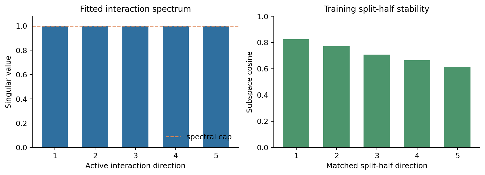
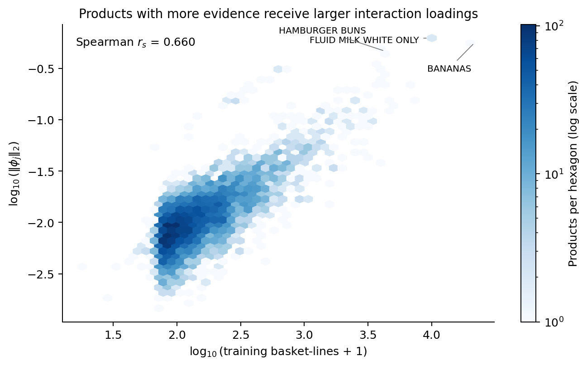
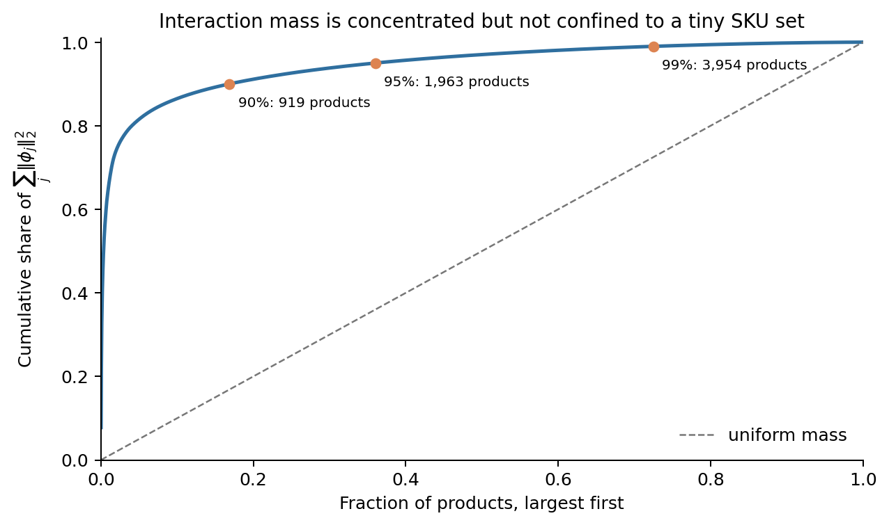
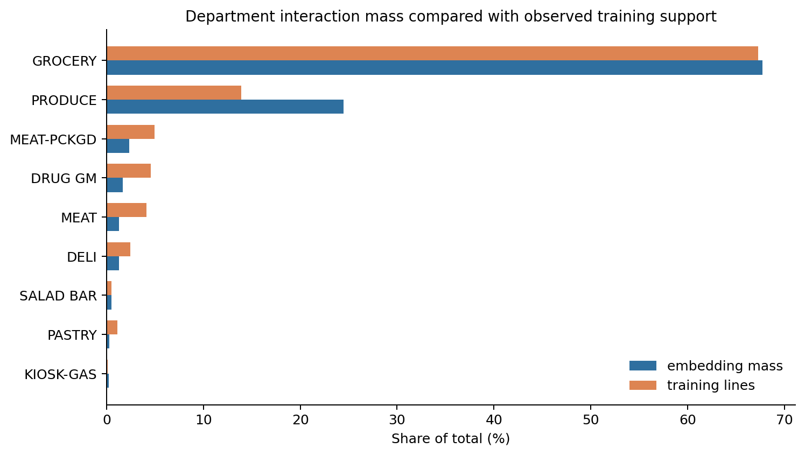
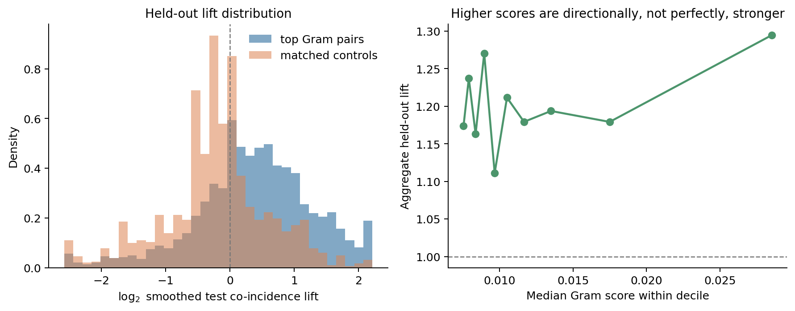

# Learned interaction embeddings: audit against the transaction data

## Conclusion first

The rank-5 interaction embedding contains reproducible aggregate co-purchase
information. Product pairs selected only from the fitted training parameters have
held-out aggregate lift **1.216**, while matched
controls have lift **0.998**. This supports
using the embedding to retrieve candidate complements.

The result is not a license to interpret every high-scoring pair as a causal
bundle. Loading magnitude is strongly related to product support, the five fitted
singular values reach their imposed cap, and the score-to-lift relationship is
positive but weak. The defensible use is therefore: retrieve with the model,
filter on support and held-out replication, and validate commercial actions in an
experiment.

## 1. What is being audited

For product $j$, the model learns a vector $\phi_j\in\mathbb{R}^5$. The
interaction contribution to the basket log-score is

$$
\sum_{i<j,\ i,j\in S}\phi_i^\top\phi_j.
$$

Thus the orientation-invariant pair score is

$$
g_{ij}=\phi_i^\top\phi_j.
$$

A positive $g_{ij}$ raises the model score when the two products occur together,
after the additive household, product, price, promotion, store, season, category
and basket-size terms have been accounted for. For two products in the same
affinity group, the complete pair-specific coefficient also contains the fitted
category term $-
ho_{c(i)}$. Basket-size curvature contributes a common
background-size term to a full cross-difference.

Individual coordinates of $\phi_j$ are not uniquely identified: replacing
$\Phi$ by $\Phi Q$ for an orthogonal matrix $Q$ leaves every $g_{ij}$ unchanged.
Consequently this report interprets norms, subspaces and Gram products—not named
embedding axes.

## 2. Audit design and leakage control

The accepted checkpoint contains 5,455 products and active
rank 5. Geometry and candidate pair selection use the
trained parameters and training-only product counts. Only after the 2,000 strongest
eligible cross-affinity pairs are fixed do we inspect all 23,340 test baskets.
Products must have at least 100 training basket-lines. Controls are matched using
training frequency and training-household support. Test outcomes never select a
pair or control.

The held-out reference is a configuration null. If $f_i$ is the test incidence of
product $i$ and $n_t$ is test basket size, its expected co-incidence is

$$
E_{ij}^{\mathrm{null}}=f_i f_j
\frac{\sum_t n_t(n_t-1)}{(\sum_t n_t)(\sum_t n_t-1)}.
$$

This preserves product frequencies and the test basket-size sequence. It does not
control every household, store or seasonal covariate, so the test is predictive
rather than causal.

## 3. Rank and stability



All five active singular values equal the spectral cap of 1. This means the rank-5
model uses all permitted interaction directions, but their absolute scale is
partly determined by the safety constraint. Relative pair ordering is more
defensible than interpreting coefficient magnitude as an unconstrained optimum.

The split-half subspace cosines are 0.824, 0.769, 0.706, 0.663, 0.613. Their mean
squared overlap is 0.517. The leading directions
are reproducible, while the fifth is noticeably less stable. This agrees with the
pipeline's decision to use rank 5 rather than force rank 8.

## 4. Which products carry the interaction signal



The Spearman correlation between $\|\phi_j\|_2$ and training basket-lines is
**0.660**; with the number of training
households it is **0.614**. The model
therefore assigns most interaction leverage where the input data can estimate it.
This is statistically sensible, but it means a low norm for a rare product should
not be read as evidence that the product has no complements.



The largest 919/1,963/3,954 products carry 90%/95%/99% of total squared
embedding norm. Signal is concentrated, but it is not a tiny sparse lookup table:
roughly one third of the catalogue is needed for 95% of the mass.

### Products with the largest norms

| Product | Department | Training lines | Training households | $\|\phi_j\|_2$ |
|---|---|---:|---:|---:|
| FLUID MILK WHITE ONLY (995242) | GROCERY | 9,454 | 1,178 | 0.6231 |
| FLUID MILK WHITE ONLY (1029743) | GROCERY | 10,209 | 1,054 | 0.6226 |
| BANANAS (1082185) | PRODUCE | 21,727 | 1,677 | 0.5612 |
| HAMBURGER BUNS (826249) | GROCERY | 4,307 | 1,081 | 0.4646 |
| HOT DOG BUNS (1098066) | GROCERY | 3,991 | 1,089 | 0.4619 |
| CUCUMBERS (860776) | PRODUCE | 3,670 | 867 | 0.3382 |
| SOFT DRINK POWDER POUCHES (1053763) | GROCERY | 698 | 310 | 0.3242 |
| PEPPERS GREEN BELL (995785) | PRODUCE | 3,703 | 968 | 0.3146 |
| SOFT DRINK POWDER POUCHES (989075) | GROCERY | 578 | 291 | 0.3012 |
| SOFT DRINK POWDER POUCHES (951526) | GROCERY | 579 | 284 | 0.2994 |
| HEAD LETTUCE (904360) | PRODUCE | 4,252 | 1,045 | 0.2698 |
| SOFT DRINK POWDER POUCHES (900491) | GROCERY | 429 | 209 | 0.2516 |
| SOFT DRINK POWDER POUCHES (824555) | GROCERY | 505 | 252 | 0.2464 |
| CHOCOLATE MILK (908531) | GROCERY | 3,892 | 745 | 0.2362 |
| EGGS - X-LARGE (981760) | GROCERY | 6,813 | 1,334 | 0.2352 |

These are high-leverage products, not automatically complements with every other
high-norm product. A specific bundle hypothesis still requires $g_{ij}>0$ and
held-out support for that pair.

## 5. Department-level allocation



Grocery supplies 67.7% of embedding
mass and 67.3% of training lines.
Produce supplies 24.5% of embedding
mass despite only 13.9% of lines.
Produce is therefore interaction-rich relative to its observed volume, consistent
with recurring fruit and vegetable combinations. Very small departments should not
be compared by percentage alone because one product can dominate them.

## 6. Do high-scoring pairs appear together in held-out baskets?



| Panel | Pairs | Observed test co-incidences | Null expected | Aggregate lift | Above null |
|---|---:|---:|---:|---:|---:|
| Top Gram pairs | 2,000 | 29,911 | 24,589.4 | 1.216 | 68.0% |
| Matched controls | 2,000 | 27,908 | 27,959.4 | 0.998 | 32.7% |

Across the selected pairs, Gram score and smoothed held-out lift have Spearman
correlation **0.142**. This is positive but weak:
the embedding is informative in aggregate, while individual-pair uncertainty and
uncontrolled context remain substantial.

### Highest cross-affinity pair scores

| Rank | Pair | Gram score | Test observed / expected | Smoothed lift | Reading |
|---:|---|---:|---:|---:|---|
| 1 | BANANAS — STRAWBERRIES | 0.1048 | 37 / 23.9 | 1.54 | replicates |
| 2 | CUCUMBERS — PEPPERS GREEN BELL | 0.1044 | 99 / 30.7 | 3.19 | replicates |
| 3 | EGGS - X-LARGE — BANANAS | 0.0976 | 280 / 317.6 | 0.88 | does not replicate individually |
| 4 | GRAPES WHITE — BANANAS | 0.0884 | 206 / 145.7 | 1.41 | replicates |
| 5 | CUCUMBERS — HEAD LETTUCE | 0.0858 | 3 / 1.4 | 1.87 | replicates |
| 6 | HEAD LETTUCE — PEPPERS GREEN BELL | 0.0818 | 3 / 1.6 | 1.64 | replicates |
| 7 | CUCUMBERS — BROCCOLI WHOLE&CROWNS | 0.0674 | 49 / 19.4 | 2.49 | replicates |
| 8 | CUCUMBERS — CARROTS MINI PEELED | 0.0656 | 64 / 27.3 | 2.32 | replicates |
| 9 | BROCCOLI WHOLE&CROWNS — PEPPERS GREEN BELL | 0.0615 | 46 / 23.0 | 1.98 | replicates |
| 10 | CARROTS MINI PEELED — PEPPERS GREEN BELL | 0.0599 | 65 / 32.4 | 1.99 | replicates |
| 11 | CUCUMBERS — TOMATOES VINE RIPE BULK | 0.0591 | 30 / 16.1 | 1.84 | replicates |
| 12 | ONIONS OTHER — CUCUMBERS | 0.0584 | 57 / 20.6 | 2.72 | replicates |
| 13 | GRAPES RED — BANANAS | 0.0579 | 253 / 168.7 | 1.50 | replicates |
| 14 | CARROTS MINI PEELED — BANANAS | 0.0574 | 224 / 175.0 | 1.28 | replicates |
| 15 | TOMATOES HOTHOUSE ON THE VINE — CUCUMBERS | 0.0570 | 42 / 13.8 | 2.98 | replicates |
| 16 | PEPPERS GREEN BELL — TOMATOES VINE RIPE BULK | 0.0565 | 29 / 19.1 | 1.50 | replicates |
| 17 | PREMIUM - MEAT — HOT DOG BUNS | 0.0553 | 23 / 3.0 | 6.76 | replicates |
| 18 | ONIONS OTHER — PEPPERS GREEN BELL | 0.0546 | 69 / 24.5 | 2.78 | replicates |
| 19 | HAMBURGER BUNS — PREMIUM - MEAT | 0.0539 | 12 / 3.8 | 2.89 | replicates |
| 20 | FLUID MILK WHITE ONLY — BANANAS | 0.0513 | 168 / 162.1 | 1.04 | replicates |

The table deliberately retains failures. A high model score can identify a useful
population-level family of pairs without guaranteeing that every SKU pair survives
a finite held-out sample. Removing contradictory examples would overstate the model.

## 7. Operational interpretation

A retailer can use the embedding as a retrieval layer:

1. For an anchor SKU $i$, rank eligible products by $g_{ij}$.
2. Add the category coefficient when $i$ and $j$ share an affinity group.
3. Require minimum transaction and household support.
4. Check held-out or recent-period co-incidence against a frequency-aware null.
5. Pass surviving candidates to the basket model for customer/context-specific
   scoring, then to an A/B promotion test before making a causal claim.

The embedding is most defensible for candidate generation, related-item retrieval
and interpretable basket hypotheses. It should not be sold as proof that discounting
one product causes demand for another: observational co-purchase and cross-price
causality are different estimands.

## 8. Final assessment

- **Information learned:** yes. Selected pairs beat frequency/size-matched controls
  on untouched test baskets.
- **Rank justified:** rank 5 is the largest stable audited subspace; rank 8 is not
  supported by the split-half audit.
- **Magnitude fully identified by data:** no. Every singular value reaches the
  spectral cap.
- **Every top pair trustworthy:** no. Aggregate enrichment is clear, but some
  individual pairs contradict the held-out data.
- **Commercial use:** use the kernel for retrieval and hypothesis formation, with
  support filters and experimental confirmation.

## Reproducibility

- Checkpoint SHA-256: `16fc25816515a5ba476c7d16191201d281011b994890aa8609044e7a6781d505`
- Data fingerprint: `ffad638b6bb4bac06371c5bc2d4e82bc0f4a32e9adcfb394bd849c8b9b569d0a`
- Checkpoint: `/Users/ajit/Projects/nf_dunnhumby/energy_basket_intelligence/artifacts/candidate_rank1.pt`
- Test baskets: 23,340
- Pair selection uses no test outcomes.

Regenerate this report from the repository root with:

```bash
python -u scripts/version4/report_learned_interaction_embeddings.py
```
